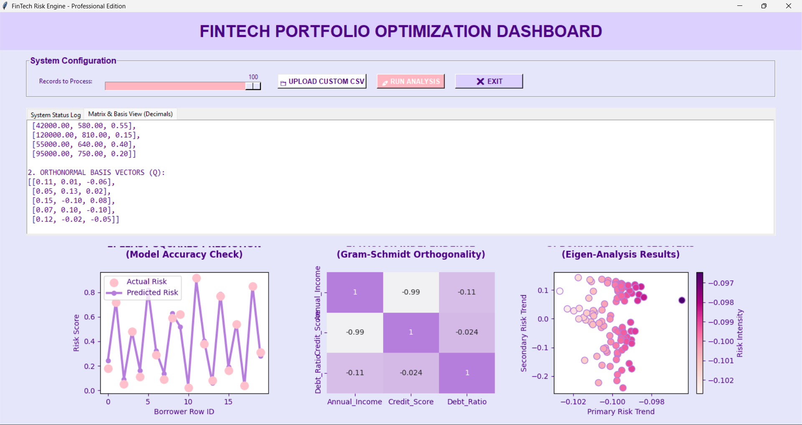
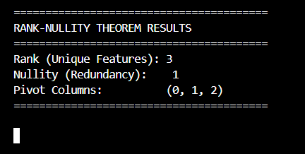

# Fintech Credit Portfolio Optimisation and Non Correlated Asset Discovery

An interactive quantitative analysis application designed to execute multi-variable credit risk modeling, detect independent asset streams, and track borrower portfolio metrics through a graphical interface.

## 🛠️ System Architecture & Logic

The application processes structural financial profiles through a multi-stage linear algebra pipeline to isolate clean, actionable trends for portfolio risk mitigation:

1. **Data Architecture & Pivot Isolation (`1.py`):** Ingests raw metrics (Annual Income, Credit Score, Debt-to-Income Ratio) and analyzes the underlying input matrix to isolate independent column bases and strip away collinear vectors.
2. **Gram-Schmidt Orthogonality (`2.py`):** Transforms the isolated matrix bases into orthonormal vectors ($Q$), eliminating variable correlation to ensure mathematically independent asset tracking.
3. **Least Squares Prediction & Matrix Modeling (`3.py` & `main2.py`):** Executes predictive risk analysis using normal equations to compute optimized weights, verifying model forecasting accuracy against historical records.

## 📈 Graphical Visualizations



The dashboard renders an interactive three-panel tracking layout powered by **Matplotlib** and **Seaborn**:
* **Least Squares Prediction:** Contrasts real data profiles against predicted risk curves to validate tracking consistency.
* **Factor Independence Heatmap:** Tracks asset correlation maps using Gram-Schmidt results to visually verify zero-collinearity metrics.
* **Borrower Risk Clusters:** Implements Eigen-analysis to execute dimensional reduction, isolating primary and secondary variance axes to cluster data intensity profiles.

## 💻 Tech Stack & Dependencies

* **Language:** Python
* **User Interface:** Tkinter, ttk
* **Mathematical Compute Engine:** NumPy, SymPy
* **Data Pipelines:** Pandas
* **Visualization Suites:** Matplotlib, Seaborn

## 🚀 Execution
``` bash
python main2.py
